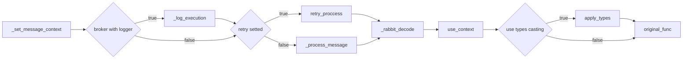

# Decorators ordering

```mermaid
  flowchart LR
    broker_logger{broker with logger}
    is_retry{retry setted}
    is_apply_types{use types casting}

    _set_message_context-->broker_logger
    
    broker_logger-->|true|_log_execution
    _log_execution-->is_retry
    broker_logger-->|false|is_retry

    is_retry-->|true|retry_proccess
    is_retry-->|false|_process_message
    retry_proccess-->_rabbit_decode
    _process_message-->_rabbit_decode

    _rabbit_decode-->use_context
    use_context-->is_apply_types

    is_apply_types-->|true|apply_types
    apply_types-->original_func
    is_apply_types-->|false|original_func
```