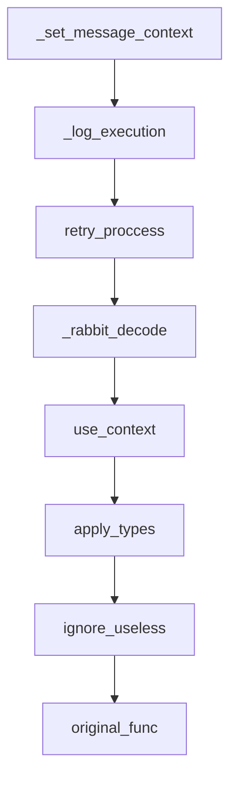

# Decorators ordering

```mermaid
  graph TD;
      _set_message_context-->_log_execution;
      _log_execution-->retry_proccess;
      retry_proccess-->_rabbit_decode;
      _rabbit_decode-->use_context;
      use_context-->apply_types;
      apply_types-->ignore_useless;
      ignore_useless-->original_func;
```