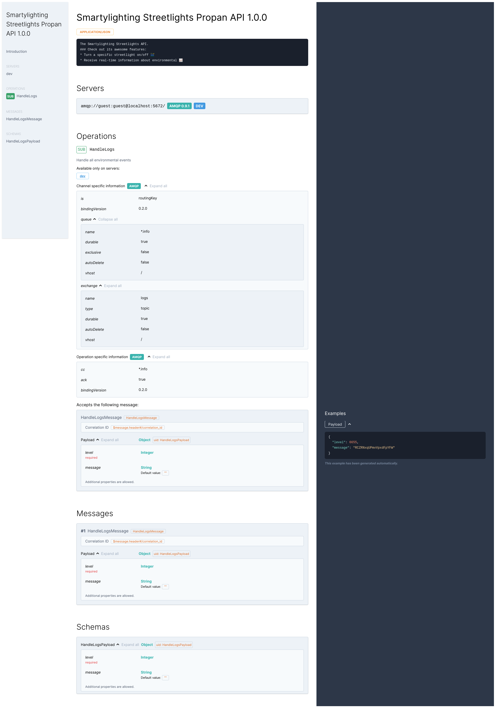

---
hide:
  - toc
---

# Documenting

**Propan** allows you not to think about the documentation of your project - it is already generated automatically in accordance with the  [**AsyncAPI**]({{ urls.asyncapi }}){.external-link target="_blank"} specification !

!!! note ""
    To work with a documentation you should install an extra requirements:

    ```console
    pip install "propan[doc]"
    ```

## Example

Let's look at an example.

To begin with, we will write a small application with the following content:

```python linenums='1'
{!> docs_src/quickstart/documentation/example.py !}
```

## YAML schema

To generate the **AsyncAPI** specification of your project in the `.yaml` format use the following command:

<div class="termy">
```console
$ propan docs gen example:app

Your project AsyncAPI scheme was placed to `./asyncapi.yaml`
```
</div>

Now you have a scheme of your project: you can use it to generate various clients in any language using an [**AsyncAPI** tools]({{ urls.asyncapi }}/tools/generator){.external-link target="_blank"}.

???- example "Asyncapi.yaml"
    ```yaml
    {!> docs_src/quickstart/documentation/example.yaml !}
    ```

## Online documentation

Also, **Propan** allows you to host HTML representation of your documentation with the following command

!!! warning ""
    The online representation of documentation does not work without an internet connection, since **CDN** dependencies are used to display it.

<div class="termy">
```console
$ propan docs serve example:app
```
</div>

This way you can provide all external consumers with access to your project documentation without additional development costs.

???- example "HTML page"
    

!!! tip
    **Propan** can also host `asyncapi.yaml` files.

```console
propan docs serve asyncapi.yaml
```

This can be useful if you want to extend the automatically generated **AsyncAPI** documentation: you just generate a file, modify and host it!

When using online documentation, you can also download it using the following paths:

* `/asyncapi.json` - **JSON** schema (available when hosting an application)
* `/asyncapi.yaml` - **YAML** schema (available for an application and a file both)

### FastAPI Plugin

When using **Propan** as a router for **FastAPI**, the framework automatically registers endpoints for hosting **AsyncAPI** documentation in your application with the following default values:

```python linenums='1'
{!> docs_src/quickstart/documentation/fastapi.py !}
```

## Own hosting

For hosting documentation **Propan** uses **FastAPI** + **uvicorn**.
You may want to implement the logic of displaying documentation yourself: restrict access rights, customize content regardless of access rights, embed documentation in your frontend application, and so on.
To do this, you can generate a `json`/`yaml`/`html` document yourself and use it in your own service.

```python linenums='1' hl_lines="9-12"
{!> docs_src/quickstart/documentation/custom_schema.py !}
```
